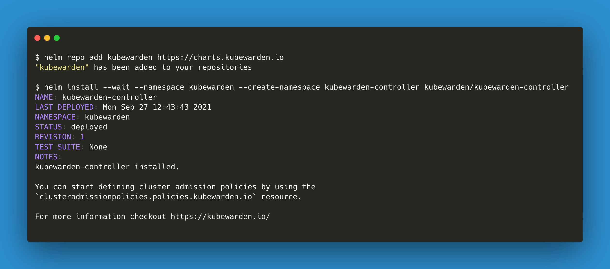
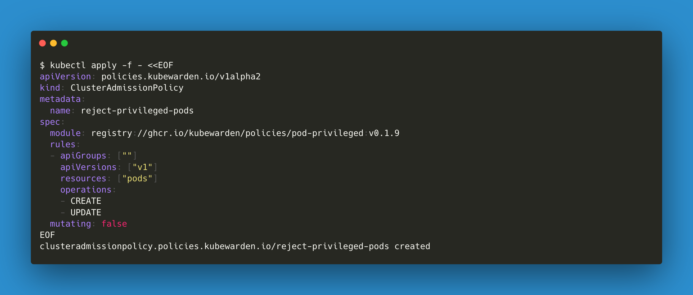
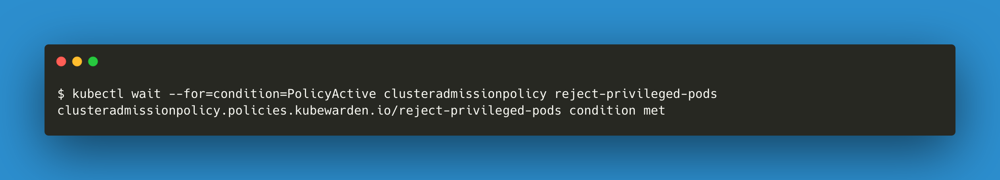
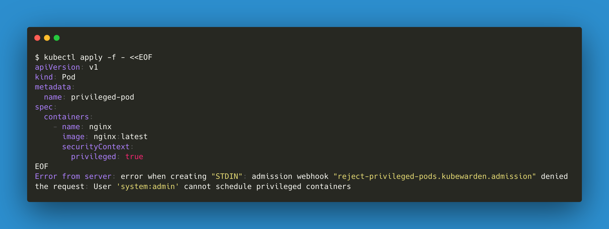
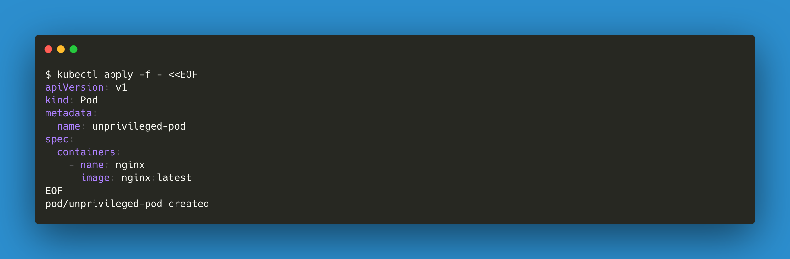

## Workflow

Show how to deploy Kubewarden, search for a policy in the Policy Hub,
deploy the policy, and test it in 6 steps.

## Deploy Kubewarden

  Rationale: straightforward to deploy.

  1. Add the helm repo
  1. Deploy the Kubewarden helm chart

```console
$ helm repo add kubewarden https://charts.kubewarden.io
"kubewarden" has been added to your repositories

$ helm install --wait --namespace kubewarden --create-namespace kubewarden-controller kubewarden/kubewarden-controller
NAME: kubewarden-controller
LAST DEPLOYED: Mon Sep 27 12:43:43 2021
NAMESPACE: kubewarden
STATUS: deployed
REVISION: 1
TEST SUITE: None
NOTES:
kubewarden-controller installed.

You can start defining cluster admission policies by using the
`clusteradmissionpolicies.policies.kubewarden.io` resource.

For more information checkout https://kubewarden.io/
```

### Screenshot



## Find a policy

  Rationale: we will now search for a policy that allows us to
  restrict privileged pods in our cluster. The Kubewarden Policy Hub
  is a place to find safe policies contributed by the Kubewarden
  project and others.

  1. Search in the Kubewarden Hub for "privileged"

### Screenshot

There are three screenshots, but only one should be linked (the one
that fits better in the medium).

- [Policy Hub](./2-find-policy/policy-hub.png)
- [Policy Hub (complete)](./2-find-policy/policy-hub-complete.png)
- [Policy Hub (with search for `privileged`)](./2-find-policy/policy-hub-search.png)

## Deploy the pod-privileged-policy policy

```console
$ kubectl apply -f - <<EOF
apiVersion: policies.kubewarden.io/v1alpha2
kind: ClusterAdmissionPolicy
metadata:
  name: reject-privileged-pods
spec:
  module: registry://ghcr.io/kubewarden/policies/pod-privileged:v0.1.9
  rules:
  - apiGroups: [""]
    apiVersions: ["v1"]
    resources: ["pods"]
    operations:
    - CREATE
    - UPDATE
  mutating: false
EOF
clusteradmissionpolicy.policies.kubewarden.io/reject-privileged-pods created
```

### Screenshot



##  Wait for the policy to be active

```console
$ kubectl wait --for=condition=PolicyActive clusteradmissionpolicy reject-privileged-pods
clusteradmissionpolicy.policies.kubewarden.io/reject-privileged-pods condition met
```

### Screenshot



##  Try to create a pod with a privileged container

```console
$ kubectl apply -f - <<EOF
apiVersion: v1
kind: Pod
metadata:
  name: privileged-pod
spec:
  containers:
    - name: nginx
      image: nginx:latest
      securityContext:
        privileged: true
EOF
Error from server: error when creating "STDIN": admission webhook "reject-privileged-pods.kubewarden.admission" denied the request: User 'system:admin' cannot schedule privileged containers
```

### Screenshot



##  Try to create a pod with no privileged containers

```console
$ kubectl apply -f - <<EOF
apiVersion: v1
kind: Pod
metadata:
  name: unprivileged-pod
spec:
  containers:
    - name: nginx
      image: nginx:latest
EOF
pod/unprivileged-pod created
```

### Screenshot


